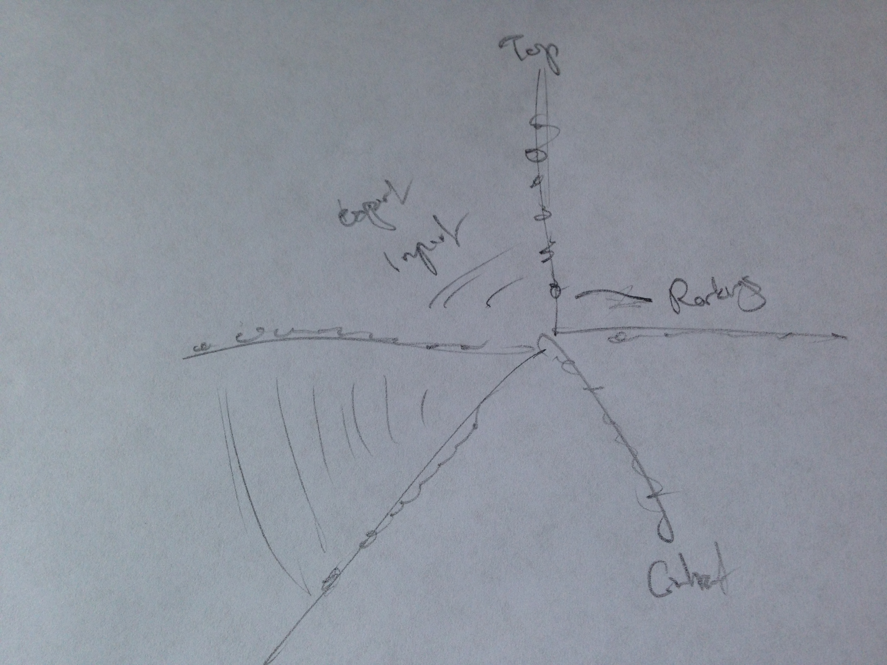
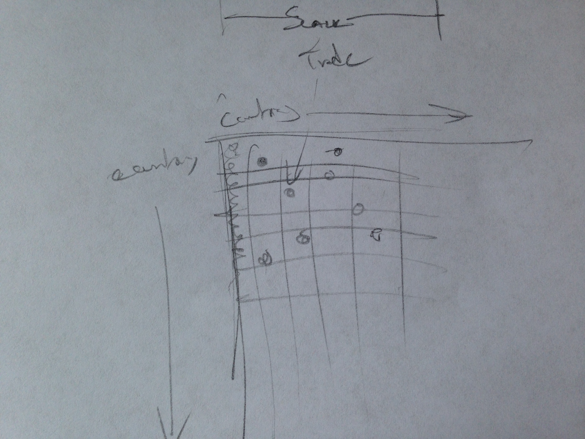
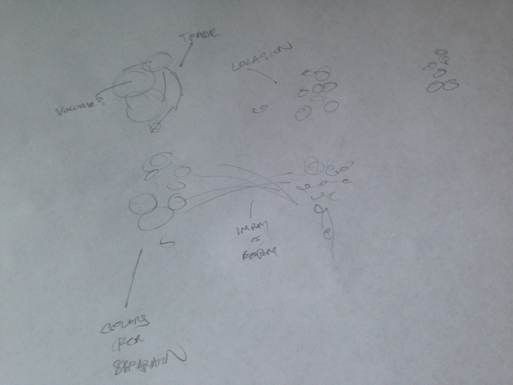

### Part 1

People who would be interested include 1) economists, 2) suppliers / distributors, 3) foreign exchange speculators. Tracking trade information over time would be particularly useful for this set, considering where exports are coming from.

1. Economists: Likely to focus on how trade volume has shifted over time. Need to focus on volume.
2. Suppliers or Distributors: Useful information on where goods flow, focused primarily on geography.
3. Foreign Exchange Speculators: Interested in seeing the shift in imports vs. exports over time for certain countries and where the information is valuable.

### Part 2

  
  
  

### Part 3

- Cannot be too restrictive in final design, should let nodes be fairly spaced and represent something else with size / color. 
- Important to remember that all countries can trade with any other country, and grouping can restrict this information.